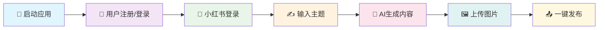
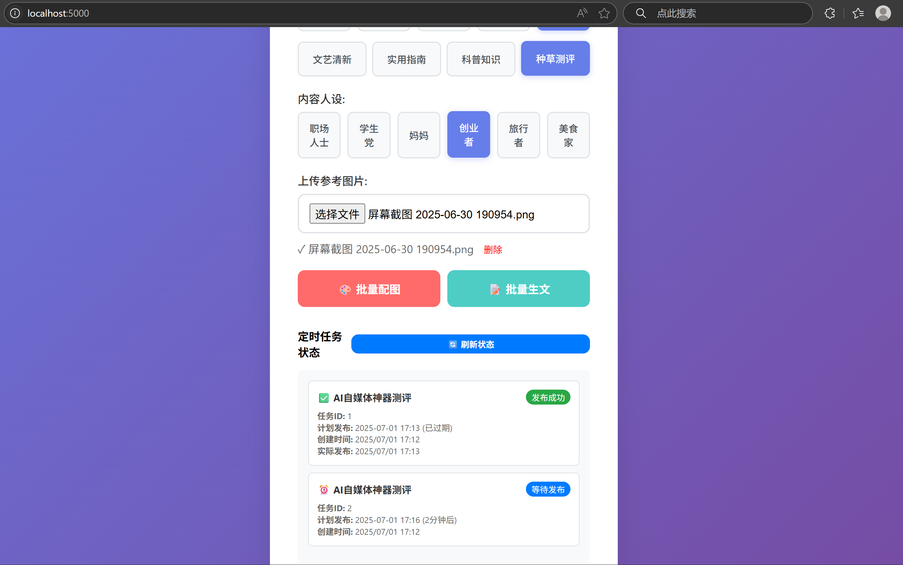
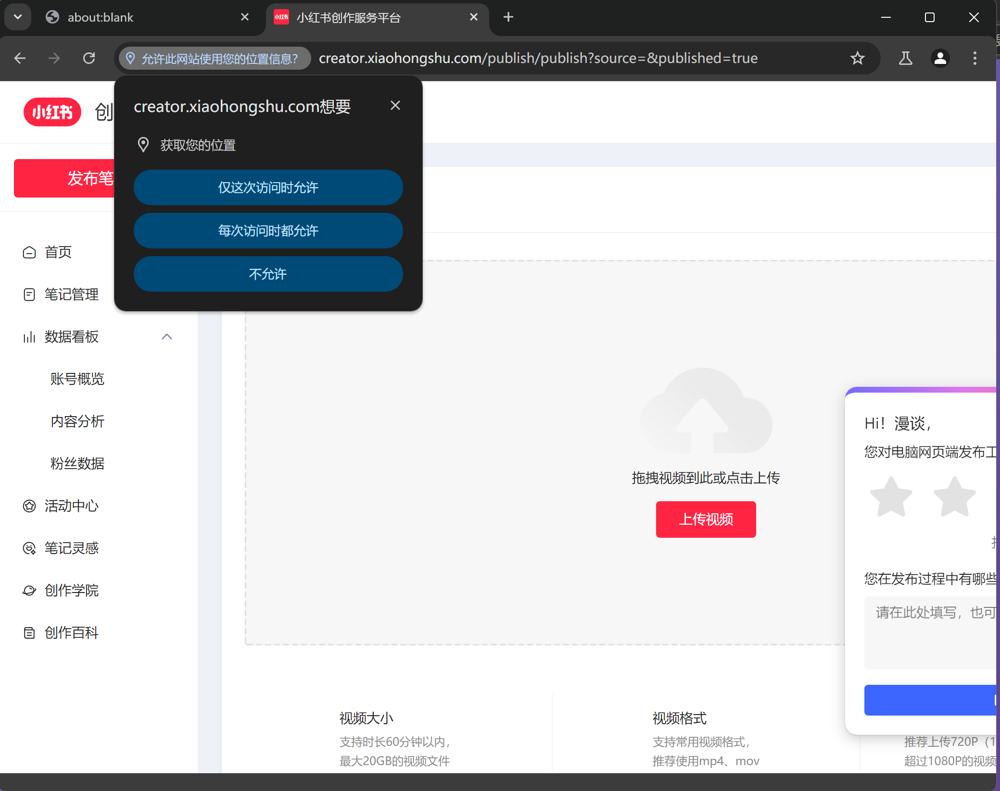

<div align="center">

# 🌟 小红书AI自动发布助手 🌟


<br/>


<br/>


<br/><br/>

<h2>🎨 智能内容创作 • 🤖 AI驱动 • 📱 一键发布</h2>

<br/>

<div style="background: linear-gradient(135deg, #667eea 0%, #764ba2 100%); padding: 20px; border-radius: 15px; margin: 20px 0;">
  <h3 style="color: white; margin: 0;">✨ 让内容创作变得简单而高效 ✨</h3>
  <p style="color: #f0f0f0; margin: 10px 0 0 0;">基于Node.js和Puppeteer技术，为内容创作者提供全流程自动化解决方案</p>
</div>

</div>

---

<div align="center">

## 📖 项目简介


<br/><br/>

**小红书AI自动发布助手** 是一个功能强大的自动化内容创作与发布工具，基于Node.js和Puppeteer技术开发，集成DeepSeek AI模型，为内容创作者提供从内容生成到自动发布的全流程解决方案。

</div>

<div align="center">

### 🎯 核心价值

<table>
<tr>
<td align="center" width="25%">
<br/>
<sub>集成DeepSeek AI模型<br/>自动生成高质量内容</sub>
</td>
<td align="center" width="25%">
<br/>
<sub>Puppeteer浏览器自动化<br/>一键完成发布流程</sub>
</td>
<td align="center" width="25%">
<br/>
<sub>响应式Web界面<br/>用户体验极佳</sub>
</td>
<td align="center" width="25%">
<br/>
<sub>从内容生成到发布<br/>全流程自动化</sub>
</td>
</tr>
</table>

</div>

---

<div align="center">

## ✨ 核心功能


</div>

<table>
<tr>
<td width="50%">

### 🤖 AI智能生成
- 🎯 **DeepSeek集成**：集成DeepSeek AI模型，智能生成内容
- 📝 **多样化风格**：支持干货分享、情感故事、生活记录等9种风格
- 👤 **人设定制**：提供职场人士、学生党、妈妈等11种人设选择
- 🏷️ **智能优化**：自动生成符合小红书特色的标题和内容

</td>
<td width="50%">

### 🚀 自动化发布
- 🌐 **浏览器自动化**：基于Puppeteer实现全自动发布
- 📱 **智能登录**：支持手机号验证码登录，自动保存状态
- 🖼️ **多图上传**：支持批量上传图片（最多9张）
- ⏰ **定时发布**：支持定时任务和批量发布

</td>
</tr>
<tr>
<td width="50%">

### 👥 用户管理
- 🔐 **身份验证**：完整的JWT用户认证系统
- 👤 **个人资料**：支持用户注册、登录和资料管理
- 🍪 **状态保存**：自动保存登录Cookie和会话状态
- 📊 **发布记录**：记录发布历史和状态监控

</td>
<td width="50%">

### 🛡️ 安全稳定
- 🔒 **数据安全**：本地数据存储，保护用户隐私
- 🛡️ **反检测**：模拟真实用户操作，降低检测风险
- 📝 **错误处理**：完善的错误处理和恢复机制
- 🔄 **自动重试**：智能重试机制，提高成功率

</td>
</tr>
</table>

---

<div align="center">

## 🏗️ 技术架构


</div>

<div align="center">

### 🛠️ 技术栈

<table>
<tr>
<td align="center" width="25%">
<br/>
<sub>🚀 后端运行时环境</sub>
</td>
<td align="center" width="25%">
<br/>
<sub>🌐 Web应用框架</sub>
</td>
<td align="center" width="25%">
<br/>
<sub>🤖 浏览器自动化</sub>
</td>
<td align="center" width="25%">
<br/>
<sub>🧠 AI内容生成</sub>
</td>
</tr>
<tr>
<td align="center" width="25%">
<br/>
<sub>🔐 身份验证</sub>
</td>
<td align="center" width="25%">
<br/>
<sub>📁 文件上传</sub>
</td>
<td align="center" width="25%">
<br/>
<sub>🌐 HTTP客户端</sub>
</td>
<td align="center" width="25%">
<br/>
<sub>🎨 前端界面</sub>
</td>
</tr>
</table>

</div>

---

<div align="center">

## 📁 项目架构


</div>

```
📦 xhs_auto_publisher_js/
├── 📂 static/                       # 🎨 前端静态资源
│   └── 📄 index.html               # 🌐 主界面文件
├── 📂 uploads/                      # 📁 图片上传目录
├── 🚀 main.js                       # 🖥️ Electron主进程
├── 🌐 server.js                     # 🔧 主服务器(端口5000)
├── 🔗 mcp-server.js                 # 🤖 MCP服务器(端口3001)
├── 📱 xiaohongshu-poster.js         # 🎯 小红书发布核心逻辑
├── 🎮 start.js                      # 🚀 启动脚本
├── 🔧 simple-server.js              # 💡 简化服务器
├── 🌐 api.js                        # 🎨 图片生成API
├── 📦 package.json                  # 📋 项目配置
├── 🍪 xiaohongshu_cookies.json     # 🔐 登录状态保存
├── 📄 latest_publish.json          # 📊 最新发布记录
└── 📖 README.md                     # 📚 项目说明
```

---

<div align="center">

## 🛠️ 快速开始


### 📋 环境要求

</div>

<div align="center">

| 组件 | 版本要求 | 说明 |
|:---:|:---:|:---:|
| 🟢 **Node.js** | `16.0+` | 推荐使用18.0+版本 |
| 🌐 **Chrome** | `90+` | 用于Puppeteer自动化 |
| 💾 **内存** | `4GB+` | 推荐8GB以上 |
| 💿 **磁盘** | `2GB+` | 用于存储依赖和数据 |

</div>

<div align="center">

### 🚀 安装步骤

</div>

<details>
<summary>📥 <strong>方式一：源码安装（推荐开发者）</strong></summary>

```bash
# 1️⃣ 克隆项目
git clone https://github.com/yourusername/xhs_auto_publisher_js.git
cd xhs_auto_publisher_js

# 2️⃣ 安装依赖
npm install

# 3️⃣ 启动应用
# 方式一：使用启动脚本（推荐）
node start.js

# 方式二：分别启动服务
node server.js        # 主服务器（端口5000）
node mcp-server.js    # MCP服务器（端口3001）

# 方式三：Electron桌面应用
npm start
```

</details>

<details>
<summary>📦 <strong>方式二：Electron桌面应用</strong></summary>

```bash
# 1️⃣ 安装依赖
npm install

# 2️⃣ 启动Electron应用
npm start

# 3️⃣ 打包应用（可选）
npm run build
```

**注意事项：**
- ✅ 支持 Windows 10/11 系统
- ⏱️ 首次运行需要等待依赖加载
- 🛡️ 如遇杀毒软件报警，请添加信任

</details>

---

<div align="center">

## 📱 使用指南


### 🎯 基础使用流程

</div>

<div align="center">



</div>

<div align="center">

### 📝 详细操作步骤


</div>

<table>
<tr>
<td width="50%">

**1. 🚀 启动应用**
- 运行 `node start.js` 或 `npm start`
- 访问 http://localhost:5000
- 等待应用加载完成

**2. 👤 用户管理**
- 首次使用需要注册新用户
- 输入用户名、邮箱和密码
- 登录后获得访问令牌

**3. 📱 小红书登录**
- 输入小红书手机号码
- 点击发送验证码
- 输入验证码完成登录

**4. ✍️ 内容创作**
- 选择内容风格和人设
- 输入创作主题
- 点击"生成内容"按钮

</td>
<td width="50%">

**5. 🤖 AI生成**
- DeepSeek AI自动生成标题
- 根据风格和人设生成内容
- 内容符合小红书特色

**6. 🖼️ 图片处理**
- 支持拖拽上传图片
- 最多支持9张图片
- 自动处理图片格式

**7. 📤 发布笔记**
- 预览生成的内容
- 点击"发布笔记"按钮
- 自动完成发布流程

**8. 📊 状态监控**
- 实时显示发布状态
- 查看发布结果反馈
- 自动保存发布记录

</td>
</tr>
</table>

---

<div align="center">

## 🎨 界面预览


### 📱 实际界面截图

<div align="center">

#### 🚀 发布笔记界面

<sub>📝 智能内容生成与发布界面，支持AI生成内容、多种风格选择和人设定制</sub>

<br/><br/>

#### ⏰ 批量定时发布界面

<sub>🕒 批量定时发布功能，支持设置发布数量和时间间隔</sub>

<br/><br/>

#### ✅ 发布成功界面

<sub>🎉 自动发布到小红书创作者平台，实时显示发布状态和结果</sub>

</div>

### 📱 主要功能展示

<table>
<tr>
<td align="center">

<br/>
<sub>💡 现代化的用户认证界面</sub>
</td>
<td align="center">

<br/>
<sub>🎯 智能内容创作界面</sub>
</td>
</tr>
<tr>
<td align="center">

<br/>
<sub>🔐 小红书账号登录管理</sub>
</td>
<td align="center">

<br/>
<sub>🚀 一键自动发布功能</sub>
</td>
</tr>
</table>

**✨ 界面特色：**
- 🎨 现代化响应式设计
- 📱 支持多标签页管理
- 🖱️ 拖拽式文件上传
- 📊 实时状态反馈
- 🌈 渐变色彩搭配
- 🤖 AI智能内容生成
- ⏰ 批量定时发布功能

</div>

---

<div align="center">

## 🔧 高级配置


</div>

### ⚙️ 服务器配置

<details>
<summary>🌐 <strong>端口配置</strong></summary>

```javascript
// server.js - 主服务器
const PORT = process.env.PORT || 5000;

// mcp-server.js - MCP服务器
const MCP_PORT = 3001;

// main.js - Electron应用
const SERVER_PORT = 5000;
```

</details>

<details>
<summary>🤖 <strong>AI配置</strong></summary>

```javascript
// DeepSeek API配置
const DEEPSEEK_API_KEY = "your-api-key";
const DEEPSEEK_API_URL = "https://api.deepseek.com/v1/chat/completions";

// AI生成参数
const AI_CONFIG = {
  model: "deepseek-chat",
  temperature: 1.0,
  max_tokens: 1000
};
```

</details>

<details>
<summary>🌐 <strong>浏览器配置</strong></summary>

```javascript
// Puppeteer配置
const BROWSER_CONFIG = {
  headless: false,
  args: [
    '--no-sandbox',
    '--disable-setuid-sandbox',
    '--disable-dev-shm-usage',
    '--lang=zh-CN'
  ]
};
```

</details>

---

<div align="center">

## 📊 API文档


</div>

### 🔐 用户认证接口

| 接口 | 方法 | 路径 | 说明 |
|:---:|:---:|:---:|:---:|
| 用户注册 | POST | `/api/register` | 注册新用户账号 |
| 用户登录 | POST | `/api/login` | 用户登录验证 |
| 文件上传 | POST | `/api/upload` | 上传图片文件 |

### 🤖 AI生成接口

| 接口 | 方法 | 路径 | 说明 |
|:---:|:---:|:---:|:---:|
| 生成内容 | POST | `/api/generate-note` | AI生成笔记内容 |
| 生成图片 | POST | `/api/generate-image` | AI生成配图 |

### 📱 小红书接口

| 接口 | 方法 | 路径 | 说明 |
|:---:|:---:|:---:|:---:|
| 初始化 | POST | `/init` | 初始化浏览器 |
| 发送验证码 | POST | `/send-code` | 发送登录验证码 |
| 验证码登录 | POST | `/login-with-code` | 使用验证码登录 |
| 发布笔记 | POST | `/publish` | 发布图文笔记 |
| 关闭浏览器 | POST | `/close` | 关闭浏览器实例 |

---

<div align="center">

## 🤝 参与贡献


**🎉 我们欢迎所有形式的贡献！**

</div>

<div align="center">

### 🚀 贡献方式

<table>
<tr>
<td align="center" width="25%">
<br/>
<sub>发现并修复程序错误</sub>
</td>
<td align="center" width="25%">
<br/>
<sub>添加新功能和改进</sub>
</td>
<td align="center" width="25%">
<br/>
<sub>完善项目文档</sub>
</td>
<td align="center" width="25%">
<br/>
<sub>编写测试代码</sub>
</td>
</tr>
</table>

</div>

### 📝 贡献步骤

1. **🍴 Fork 项目**
   ```bash
   git clone https://github.com/yourusername/xhs_auto_publisher_js.git
   ```

2. **🌿 创建分支**
   ```bash
   git checkout -b feature/your-feature-name
   ```

3. **💻 提交更改**
   ```bash
   git commit -m "✨ Add: 新功能描述"
   ```

4. **📤 推送分支**
   ```bash
   git push origin feature/your-feature-name
   ```

5. **🔄 创建 Pull Request**

---

<div align="center">

## 📄 许可证


本项目采用 [MIT](./LICENSE) 许可证

</div>

---

<div align="center">

## 💖 支持项目


<br/>

<a href="https://github.com/yourusername/xhs_auto_publisher_js">

</a>

<br/><br/>

**💝 您的支持是我们持续开发的动力！**

</div>

<table>
<tr>
<td align="center">
<br/>
<sub>GitHub 点星支持</sub>
</td>
<td align="center">
<br/>
<sub>分享给更多人</sub>
</td>
<td align="center">
<br/>
<sub>提交Issue反馈</sub>
</td>
<td align="center">
<br/>
<sub>功能建议和改进</sub>
</td>
</tr>
</table>

---

<div align="center">

### 💬 联系方式

<table>
<tr>
<td align="center" width="50%">

<br/><br/>
<a href="https://github.com/yourusername/xhs_auto_publisher_js/issues">

</a>
<br/>
<sub>🔧 技术问题和Bug反馈</sub>
</td>
<td align="center" width="50%">

<br/><br/>

<br/>
<sub>📢 技术交流和合作</sub>
</td>
</tr>
</table>

<br/>

🎯 **在这里您可以：**
- 💡 获取使用技巧和最佳实践
- 🐛 反馈问题并获得快速解答  
- 🚀 第一时间了解新功能更新
- 🤝 与其他用户交流经验心得

</div>

<br/>

**🤝 期待与您的交流合作！**

---

<div style="background: linear-gradient(135deg, #667eea 0%, #764ba2 100%); padding: 30px; border-radius: 20px; margin: 30px 0;">
  <h3 align="center" style="color: white; margin: 0;">🌟 感谢您的关注和支持！🌟</h3>
  <p align="center" style="color: #f0f0f0; margin: 15px 0 0 0;">让我们一起打造更好的内容创作工具</p>
</div>
